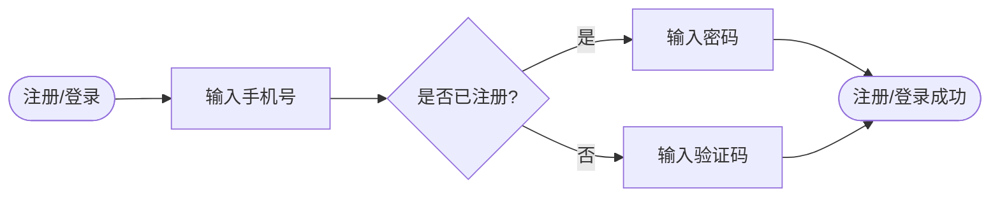

# 基于BERT的文本编码与相似度计算技术方案（约400字）

## 一、核心技术方案

在客服工作台场景中，基于BERT实现文本编码与相似度计算，核心用于用户问句与知识库问题匹配、相似咨询归类，整体技术方案分为**文本预处理、BERT编码、相似度计算**三个核心步骤：

### 1. 文本预处理

首先对客服场景文本（用户咨询、知识库问题）进行标准化处理：去除特殊符号、统一大小写、分词（中文场景无需分词，BERT支持字符级输入），然后按照BERT输入格式构造数据，添加`[CLS]`句首标识、`[SEP]`句尾/分句标识，将文本转换为token id，并生成attention mask（标识有效token），最后对超长文本进行截断（适配BERT最大输入长度，如512个token）。

### 2. BERT文本编码

采用预训练的中文BERT模型（如bert-base-chinese）进行编码：将预处理后的token id、attention mask输入BERT模型，通过模型的多层Transformer编码器提取文本语义特征。编码时选择`[CLS]`位置的输出向量作为**整句语义编码向量**（维度768），该向量能综合表征文本整体语义，是相似度计算的核心依据；若需细粒度编码，可对token级输出向量做平均/池化处理。

### 3. 相似度计算

将两个文本的BERT编码向量输入相似度计算模块，主流方案为：

- 余弦相似度：计算两个向量的余弦值（取值[-1,1]），值越接近1表示语义越相似；

- 归一化处理：将余弦相似度映射至[0,1]区间，便于业务判断（如阈值0.7以上判定为相似）；

- 阈值筛选：结合客服场景业务需求设置相似度阈值，筛选出高相似文本返回给业务系统。

## 二、流程图

## 总结

### 关键点回顾

1. BERT编码核心是提取`[CLS]`向量作为文本语义表征，适配客服场景短文本特征；

2. 相似度计算以余弦相似度为核心，需结合业务设置合理阈值；

3. 预处理环节需严格适配BERT输入格式，保证编码准确性。